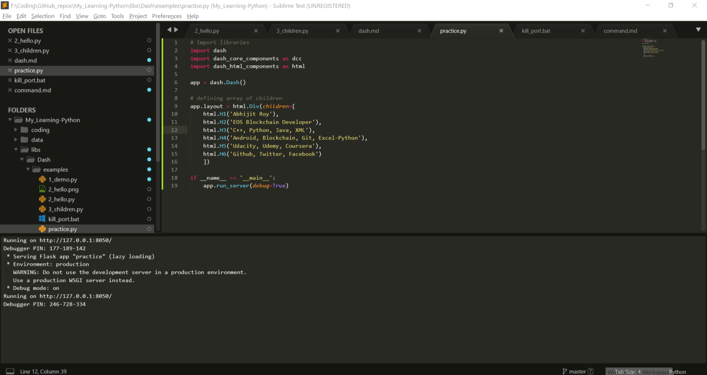
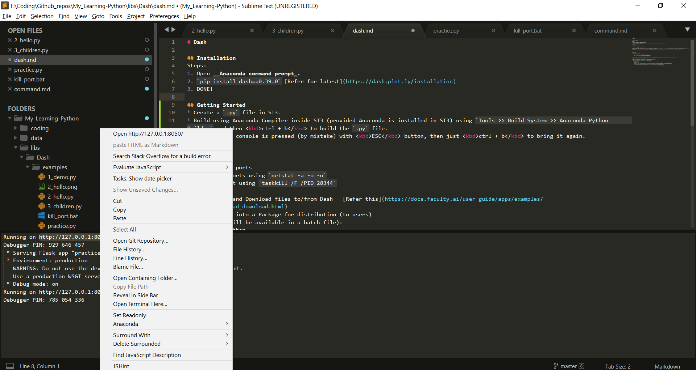

# Dash

## Installation
In Dash, following packages are installed:
* dash
* dash-core-components
* dash-html-components
* dash-renderer
* dash-table
* flask-compress
* dash-bootstrap-components

### M-1: using pip
1. Open __terminal__.
2. `pip install dash`
3. `pip install dash-bootstrap-components` : Bootstrap themed components for use in Plotly Dash
3. DONE!

### M-2: using conda
1. Open __terminal__.
2. Type `conda install -c conda-forge dash` and enter.
```console
The following packages will be downloaded:
		package                    |            build
		---------------------------|-----------------
		conda-4.6.13               |           py37_0         2.1 MB  conda-forge
		dash-0.41.0                |             py_0          39 KB  conda-forge
		dash-core-components-0.46.0|             py_0         3.6 MB  conda-forge
		dash-html-components-0.15.0|             py_0         334 KB  conda-forge
		dash-renderer-0.22.0       |             py_0         719 KB  conda-forge
		dash-table-3.6.0           |             py_0         410 KB  conda-forge
		flask-compress-1.4.0       |             py_0           6 KB  conda-forge
		------------------------------------------------------------
																					 Total:         7.1 MB
```
<br/>
3. `pip install dash-bootstrap-components` : Bootstrap themed components for use in Plotly Dash


## Getting Started
* Create a `.py` file in ST3.
* Build using Anaconda Compiler inside ST3 (provided Anaconda is installed in ST3) using `Tools >> Build System >> Anaconda Python Builder` and then <kbd>ctrl + b</kbd> to build the `.py` file.
	<p align="center">
	  
	</p>
> Note: If the console is pressed (by mistake) with <kbd>ESC</kbd> button, then just <kbd>ctrl + b</kbd> to bring it again.
* Open the http url by selecting the http url in console. It is shown below:	
	<p align="center">
	  
	</p>

## Utility
* #### Network ports
	- Show all ports using `netstat -a -o -n`
	- Kill a port using `taskkill /F /PID 28344`

* #### Upload and Download files to/from Dash - [Refer this](https://docs.faculty.ai/user-guide/apps/examples/dash_file_upload_download.html)
* #### Convert into a Package for distribution (to users)
	Steps (all will be available in a batch file):
	- Install Python
	- Install pip
	- Install a list of Dash packages (used in your project) using `pip install -r requirements.txt`
	- Open the server (with `app.py` file) in your browser using `python app.py`
* 
