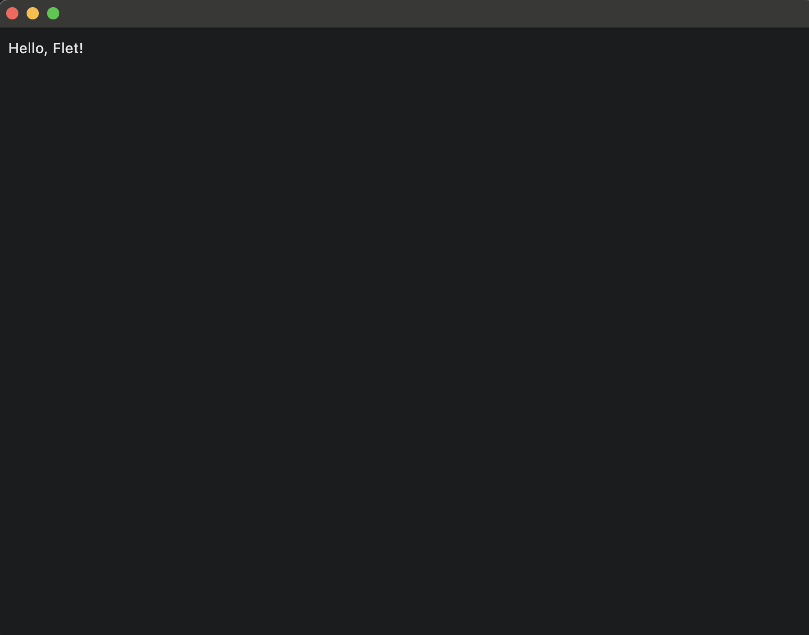
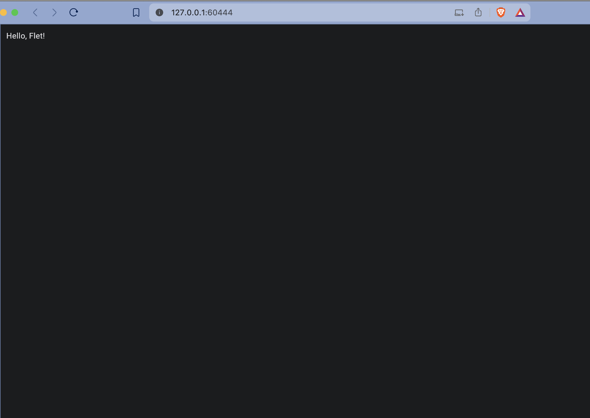
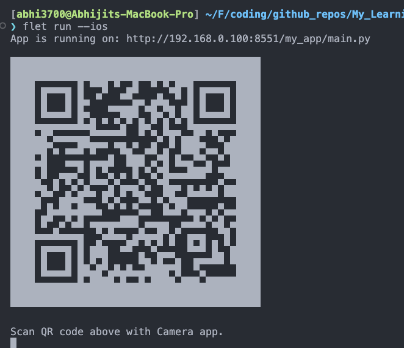

# Flet

## Description

Based on Flutter using Python lang to build cross-platform app for Desktop (linux/win/mac), Web, Mobile (Android/iOS).

## Installation

> For macOS M1.

Prerequisite python installation [here](../../README.md#macos)

For code suggestion & CLI usage, install `flet` globally on your system:

```sh
pip install flet
```

Upgrade:

```sh
pip install flet --upgrade
```

## Getting started

### Using `flet` tool

1. Create a new project:

```sh
$ flet create my_app
Done!

Run the app:

flet run my_app
```

This will create the directory as:

```sh
tree -L 3 my_app
my_app
├── README.md
├── assets
│   └── icon.png
├── main.py
└── requirements.txt

1 directory, 4 files
```

2. Run the app: `flet run` in desktop mode.



In web mode:

```sh
$ flet run --web
http://127.0.0.1:60444
^C% 
```



In ios mode:



> You need to have `flet` App installed from Appstore.

TODO:

- [ ] Pack
- [ ] Publish

### Using `huak` tool

- Build & Init:

```sh
huak build
huak init
```

- Run examples:

```sh
huak run counter
huak run todo
```

OR

```sh
cd src/flet_demo

flet run counter.py --web
flet run todo.py
```

## Commands

There are more subcommands to explore:

```sh
flet   
usage: flet [-h] [--version] {create,run,pack,publish,build} ...

positional arguments:
  {create,run,pack,publish,build}
    create              Create a new Flet app from a template.
    run                 Run Flet app.
    pack                Package Flet app to a standalone bundle.
    publish             Publish Flet app as a standalone web app.
    build               Build an executable app or install bundle.

options:
  -h, --help            show this help message and exit
  --version             show program's version number and exit
```

> Haven't used yet much.

And also more options to run on different platforms - ios, android, web, desktop; with custom host and port; custom name; provide assets folder.

```sh
$ flet run -h
usage: flet run [-h] [-v] [-p PORT] [--host HOST] [--name APP_NAME] [-m] [-d] [-r] [-n] [-w] [--ios] [--android] [-a ASSETS_DIR]
                [--ignore-dirs IGNORE_DIRS]
                [script]

Run Flet app.

positional arguments:
  script                path to a Python script

options:
  -h, --help            show this help message and exit
  -v, --verbose         -v for detailed output and -vv for more detailed
  -p PORT, --port PORT  custom TCP port to run Flet app on
  --host HOST           host to run Flet web app on. Use "*" to listen on all IPs.
  --name APP_NAME       app name to distinguish it from other on the same port
  -m, --module          treat the script as a python module path as opposed to a file path
  -d, --directory       watch script directory
  -r, --recursive       watch script directory and all sub-directories recursively
  -n, --hidden          application window is hidden on startup
  -w, --web             open app in a web browser
  --ios                 open app on iOS device
  --android             open app on Android device
  -a ASSETS_DIR, --assets ASSETS_DIR
                        path to assets directory
  --ignore-dirs IGNORE_DIRS
                        directories to ignore during watch. If more than one, separate with a comma.
```

## References

- [Documentation](https://flet.dev/)
- [Examples](https://github.com/flet-dev/examples)
