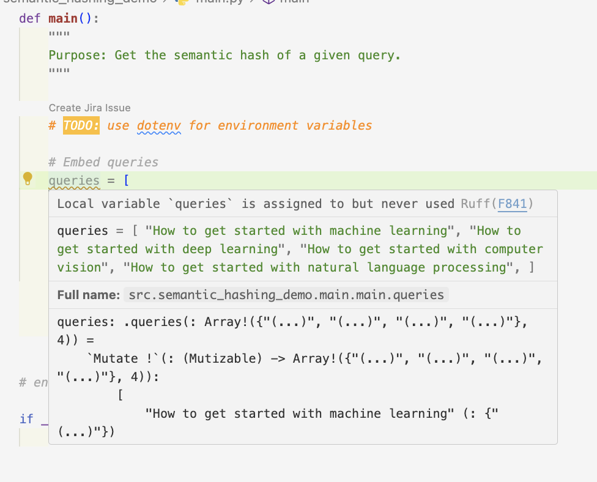

# Ruff

Linter, Formatter for Python code.

## Install

Use `brew` for macOS

```sh
brew install ruff
```

## Usage

> We can use `ruff` interchangeably with `$ huak fmt` & `$ huak lint`.

Also, we get to see the linting here in the editor itself like using `rust-analyzer` (in Rust).



If it doesn't, then just do `$ ruff .` at the root of the project containing the `pyproject.toml` file.

### Format

```sh
# format all files in the current directory
ruff format .

# format a specific file
ruff format src/demo/main.py
```

### Lint

```sh
# lint all files in the current directory
ruff lint .

# lint a specific file
ruff lint src/demo/main.py
```
