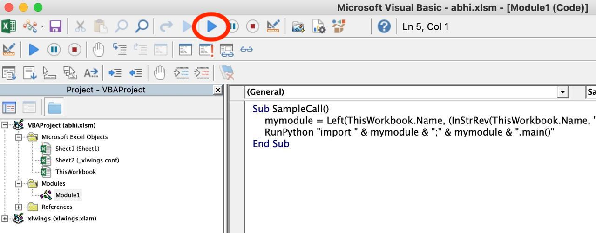

# `xlwings`

## Installation

### Windows

- **Tools:** ST3, xlwings, conda
- Steps:
  - `$ conda install -c anaconda xlwings` or `$ conda install -c anaconda xlwings=0.15.7` (latest version used)
  - `$ xlwings quickstart <project-name>`: start a excel with python project. E.g. `$ xlwings quickstart abhi`
    > NOTE: Sometime it may happen that the xlwings tab is not shown in a project's Excel file. Then just try to open an already working project excel file (with Xlwings tab).
    > Basically, once executed in an Xlwings excel file, then it is going to fit in there.
  - `$ xlwings addin install`: install xlwings into excel. If needs to upgrade, then use `$ xlwings addin upgrade`.
    > NOTE: In order to upgrade the addin, first upgrade xlwings version using `conda install xlwings=0.15.7`
  - Enable macro settings in the MS Excel
    - enable <kbd>Enable all macros</kbd> button in the `Trust Center >> Macro Settings >> Macro Settings`
    - enable <kbd>Trust access to the VBA project object model</kbd> button in the `Trust Center >> Macro Settings >> Developer Macro Settings`

### Mac

### **Troubleshooting:**

- if this error found:

```
Traceback (most recent call last):
  File "c:\users\abhijit\anaconda3\lib\runpy.py", line 193, in _run_module_as_main
    "__main__", mod_spec)
  File "c:\users\abhijit\anaconda3\lib\runpy.py", line 85, in _run_code
    exec(code, run_globals)
  File "C:\Users\abhijit\Anaconda3\Scripts\xlwings.exe\__main__.py", line 5, in <module>
  File "c:\users\abhijit\anaconda3\lib\site-packages\xlwings\__init__.py", line 42, in <module>
    from . import _xlwindows as xlplatform
  File "c:\users\abhijit\anaconda3\lib\site-packages\xlwings\_xlwindows.py", line 10, in <module>
    import win32api
ImportError: DLL load failed: The specified procedure could not be found.
```

**Solution:** <br></br>
delete all the xlwings file from C:\Users\abhijit\AppData\Roaming\ drive. And then the xlwings tab will be deleted from the excel. Now, uninstall MS office from control panel.

- Error like this:

```
No file found in this directory: "C:\Users\abhijit\AppData\Roaming\Microsoft\Excel\XLSTART\"
```

while doing `xlwings addin install`, it looks for the **xlwings.xlam** file in this directory: "C:\Users\abhijit\AppData\Roaming\Microsoft\Excel\XLSTART\". If any issue, just download `.xlam` file from github repository releases page and put it here.

## Usages

- Freeze row, column
  - click a row and do this - "View >> Freeze Panes".

## Projects

- ### Hello:

  This prints text - "Hello xlwings!" into A1 cell in sheet 1 of the workbook.

  **Steps:**

  - `$ xlwings quickstart abhi` in any preferable directory. It gives:

    ```bash
    .
    ├── abhi.py
    ├── abhi.xlsm
    ```

  - goto `"Developer"` tab in excel.
  - goto "Module1" and run.
    
  - It shows the output (as per the code).

- ### Button
  This can be used in order to run a script when needed. Basically, on a sheet in a workbook where we don't want to run the script all the time. Like <kbd>Fetch QC status</kbd> button used to display the QC status on a MessageBox.

##### **Follow the steps:**

- Go to the "Developer" tab in Excel.
- Create a button "Insert >> Button" on an excel sheet.
- Assign a macro by right clicking on the button.
- Copy and Paste the snippet from the default "module 1" to "RUN_Click" module.

```vba
Sub RUN_Click()
  Shell "cmd.exe /k cd /d" & ThisWorkbook.Path & "&& run.bat" & "&& exit"
End Sub
```

- Here, `run.bat` file is:

```bat
@echo off
python .\octopus.py
rem dot octopus.dot -T png -o octopus.png
rem pause
```

> NOTE: here, line-3 is for creating `octopus.png` file using `octopus.dot` file using [Graphviz](https://pypi.org/project/graphviz/) tool.

- From now, click on the button and the .py code will run and show the desired output.

## Shortcut keys

- <kbd>ctrl + backspace</kbd> - bring the cursor near the word, you get to see the dialog with its features. <br/>
  NOTE: Anaconda package in ST3 has to be installed first.
- <kbd>shift + F3</kbd> - shows the "Function Wizard" dialog.

## Commands, Syntax

- [Refer this file](https://github.com/abhi3700/My_learning-Python/blob/master/xlwings_commands.md)

## References

- xlwings - https://www.xlwings.org/
- xlwings Documentation - https://docs.xlwings.org/en/stable/index.html
- Common Excel Tasks Demonstrated in Pandas - http://pbpython.com/excel-pandas-comp.html
- Common Excel Tasks Demonstrated in Pandas part 2 - http://pbpython.com/excel-pandas-comp-2.html
- Combining Data From Multiple Excel Files - http://pbpython.com/excel-file-combine.html
- Generating Excel Reports from a Pandas Pivot Table - http://pbpython.com/pandas-pivot-report.html
- Improving Pandas’s Excel Output - http://pbpython.com/improve-pandas-excel-output.html
- Creating Advanced Excel Workbooks with Python - http://pbpython.com/advanced-excel-workbooks.htmlCreating Advanced Excel Workbooks with Python -
